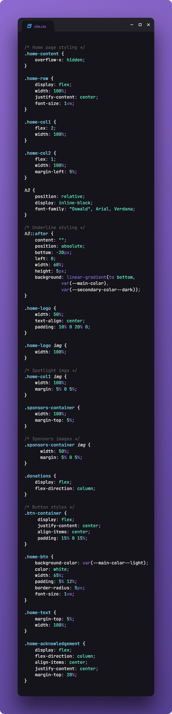
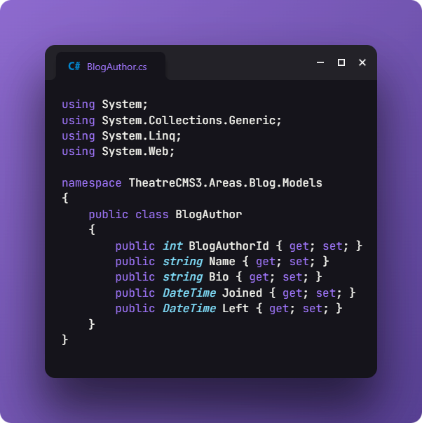
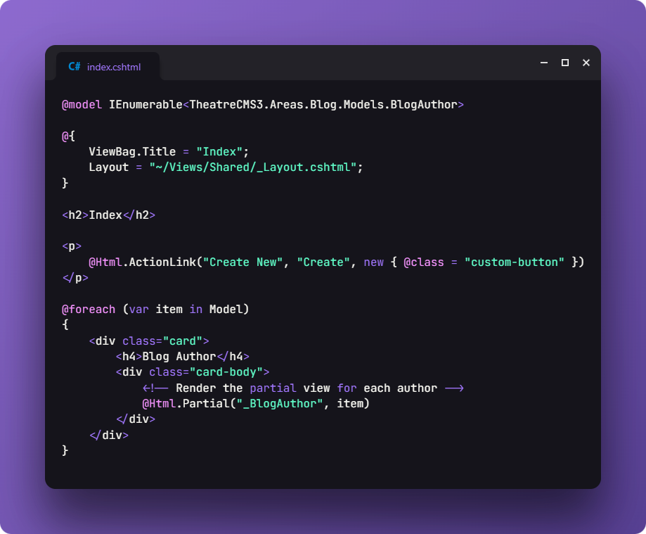
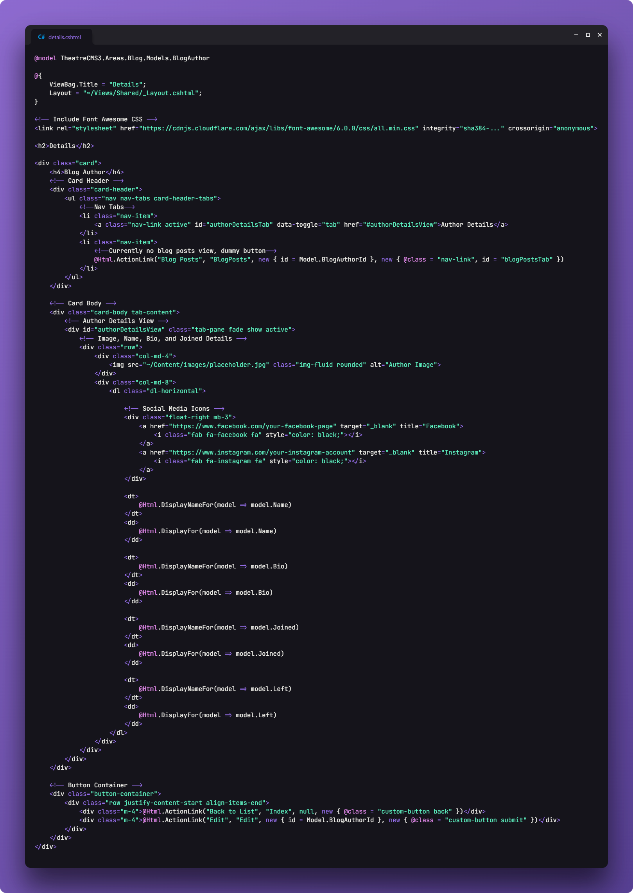

# C-Sharp-Live-Project
Collaboration on MVC web application in C# using Visual Studio, Azure DevOps, and Agile framework.

For this project I was tasked with assisting in the build of a local theatres user friendly webpage. I contributed the home page styling, creation of blog author model class, CRUD page scaffolding and styling. My focus was on creating reusable code that can be easily reviewed and added onto preventing future code conflict. Implemented best practices for functional interface and responsive styling.

Using guidelines, I styled the homepage spotlighting featured performances including a sidebar highlighting sponsors and featuring a donation button. Next I created the blog author model class and updated the database using ASP.NET, ensuring proper design. I then scaffolded the CRUD page designs using MVC framework. Using bootstrap and custom classes I styled the pages with a cohesive design. Applying bootstrap cards to display blog author information and CRUD functionality.

<h3>Project Stories</h3>
<ol>
    <li><a href="#home">Home Page Styling</a></li>
    <li><a href="#model">Model Class Creation</a></li>
    <li><a href="#crud">CRUD</a></li>
    <li><a href="#part1">Blog Author Styling Pt. 1</a></li>
    <li><a href="#part2">Blog Author Styling Pt. 2</a></li>
    <li><a href="#skills">Additional Skills</a></li>
</ol>

<h3 id="home">Home Page Styling</h3>

Home page was styled using flex box along with percentage based scaling to create a responsive page design Utilizing given color palette and content a flexbox layout spotlights theatre productions, sponsors, donation button, and company acknowledgements. Code is reusable but also prevents future code conflict.

<a href="code-snippets/home-page-html.png">Home Page HTML</a>

<h3 id="model">Model Class Creation</h3>

Created model for blog Author requiring Name and Joined while leaving Left optional, updating database using ASP.NET framework.

<h3 id="crud">CRUD</h3>

Using MVC scaffolding developed the CRUD pages for the blog author area.

<a href="code-snippets/blog-author-index.png">Index Page</a>

<a href="code-snippets/create-page.png">Create Page</a>

<a href="code-snippets/details-page.png">Details Page</a>

<h3 id="part1">Blog Author Styling Pt. 1</h3>

<h3 id="part2">Blog Author Styling Pt. 2</h3>

<h3 id="skills">Additional Skills</h3>
<ul>
    <li>Team Setting: Worked alongside other developers, utilizing Agile and Scrum framework for project management.</li>
    <li>Version Control: Maintained integrations of updates into existing architecture usiong version control.</li>
    <li>Debugging: Resolved and debugged issues in collaborations with other developers and project managers ensuring smooth workflow.</li>
</ul>

<h3>Challenges</h3>
<ul>
    <li>Coming onto a project mid development, I had to make sure I reviewed the project code forseeing code conflict with assigned tasks. To resolve any issues I would trace my steps utilizing previous code and creating custom classes as needed.</li>
    <li>With a project this scale, when assigned a task, initially I had several questions on project practices. I was able to find several answers to my questios in the project wiki/resources. When needed I reached out to project managers to clarify any quesitons.</li>
    <li></li>
</ul>